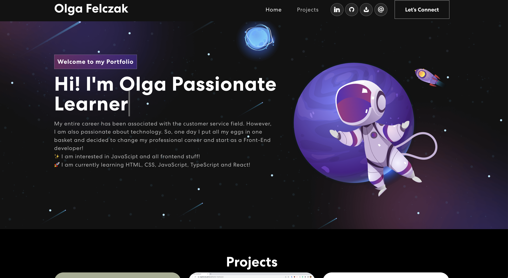

# React-Portfolio

## Description

This is the final version of my portfolio site using React.
</br>
The portfolio website was created using React & Vite. To display projects JSON file was used which contains individual project information.

## Screenshot



## Table of Contents

- [🛠 Built with](#BuiltWith)

- [💿 Installation](#Instalation)

- [💻 Local development](#LocalDevelopment)

- [💬 Questions](#Questions)

- [📝 Source](#Source)

## 🛠 Built with

[](https://skillicons.dev)

## 💿 Installation

To install necessary dependencies, run the following command:

```
yarn
```

## 💻 Local development

To run this application use the following command:

```
yarn dev
```

## 💬 Questions

Contact me if you have any questions!

- Drop me an email [ofelczak@gmail.com](mailto:ofelczak@gmail.com)
- Check out my GitHub profile [OlgaFelczak](https://github.com/OlgaFelczak)
- LinkedIn [Olga Felczak](www.linkedin.com/in/olga-felczak)

## 📝 Source

To build a base for my portfolio page I used this repository:
[judygab/web-dev-projects/personal-portfolio/](https://github.com/judygab/web-dev-projects/tree/main/personal-portfolio)
